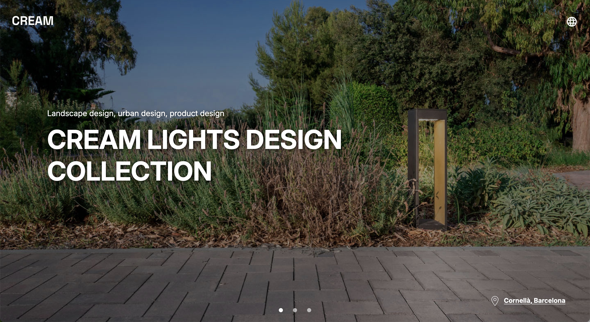

#  CREAM Web Template

A responsive and interactive website template that features a clean interface with customizable HTML, CSS, and JavaScript components. It includes multiple languages using JSON files and JavaScript

The template has been used to showcase the light collection of the architecture company CREAM (Barcelona)

## 🛠️ Technologies Used

    HTML – Structured and semantic markup for easy customization.
    CSS – Flexible styling with responsive design principles.
    JavaScript – Components like sliders and pop-up.
    JSON – Used for managing multiple languages.

## 💻 Demo

## 🧑‍💻 Usage Instructions

Clone the repository:

    git clone https://github.com/azaharacc/cream-web-template.git

Run a local server: To preview the template, you need to serve it via a local server. You can use Live Server (for Visual Studio Code), http-server, or any other local server of your choice.

Customize the content by editing the HTML, updating styles in the CSS, replacing images and translations and modifying scripts as needed.

## 💬 Notes
Partials are used to modularize sections like the header, sliders and footer for easy reuse and management. 

You can easily extend and modify this template to fit your specific needs.